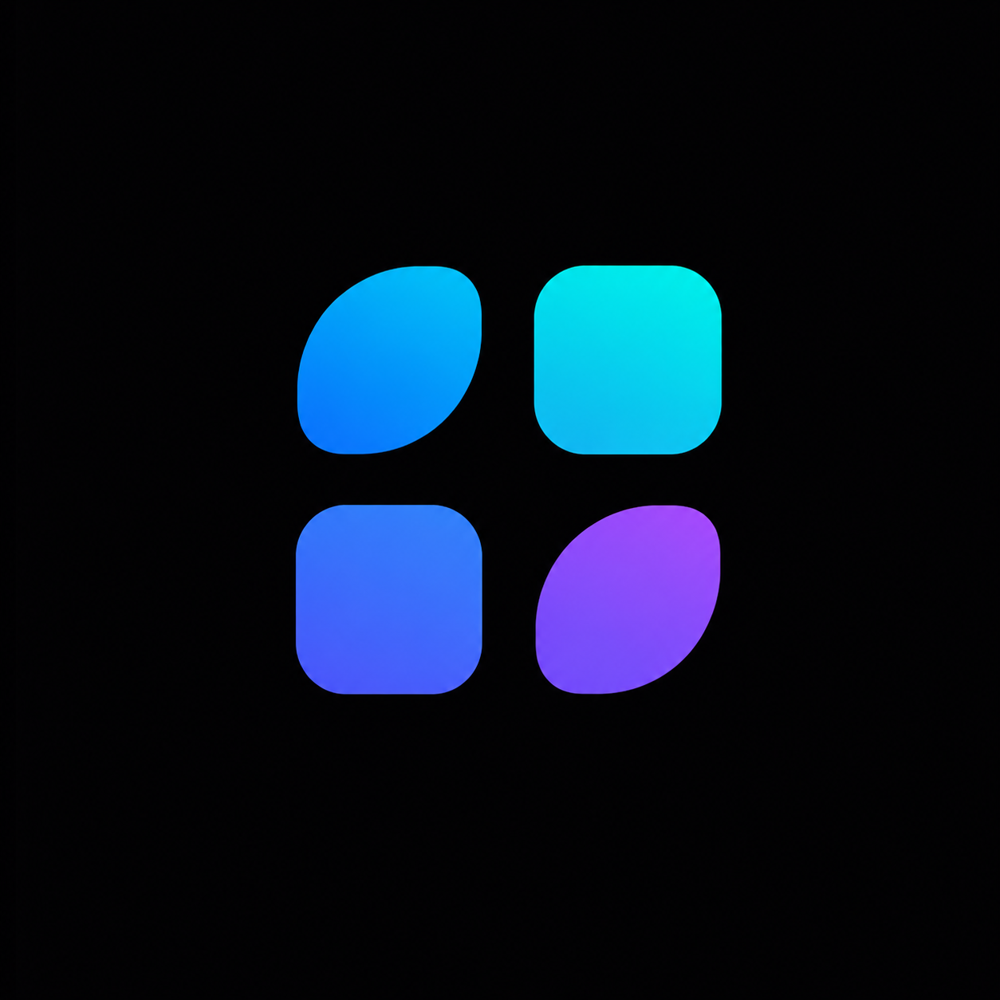

  

<h1 align="center">MultiAI Desktop</h1>

  AI-редактор и рабочая среда для проектов, моделей, Skills и MCP. 
  Один интерфейс для кода, терминала и агентных задач.

  
  

  <strong>Выберите свою систему и нажмите кнопку выше.</strong> 
  Скачивание последней версии начнётся сразу — искать файл внутри Releases не нужно.

  
  
  

---

## Скачать

| Операционная система | Архитектура | Формат | Статус | Загрузка |
|---|:---:|:---:|:---:|:---:|
| **Windows 10/11** | **x64 (64-bit)** | `.exe` | ✅ Поддерживается | **[⬇ Скачать установщик](https://github.com/SURVERS/MultiAI-Desktop-Official/releases/latest/download/MultiAI-Desktop-Windows-x64.exe)** |
| Windows 10/11 | x86 (32-bit) | `.exe` | ❌ Не выпускается | — |
| **Linux — универсальный** | **x64 (64-bit)** | `.AppImage` | ✅ Поддерживается | **[⬇ Скачать AppImage](https://github.com/SURVERS/MultiAI-Desktop-Official/releases/latest/download/MultiAI-Desktop-Linux-x64.AppImage)** |
| Ubuntu / Debian / Mint | x64 (64-bit) | `.deb` | ✅ Поддерживается | **[⬇ Скачать DEB](https://github.com/SURVERS/MultiAI-Desktop-Official/releases/latest/download/MultiAI-Desktop-Linux-x64.deb)** |
| Fedora / RHEL / openSUSE | x64 (64-bit) | `.rpm` | ✅ Поддерживается | **[⬇ Скачать RPM](https://github.com/SURVERS/MultiAI-Desktop-Official/releases/latest/download/MultiAI-Desktop-Linux-x64.rpm)** |
| Linux | ARM64 | `.AppImage` / `.deb` | ❌ Не выпускается | — |

> **x64** — это практически любой современный компьютер на Intel или AMD. Версия Windows x86/32-bit не выпускается.

### Поддержка Linux

MultiAI Desktop официально выпускается для Linux x64 в трёх форматах:

- **AppImage** — универсальный вариант для большинства современных дистрибутивов. Установка не нужна;
- **DEB** — для Ubuntu, Debian, Linux Mint и совместимых систем;
- **RPM** — для Fedora, RHEL, openSUSE и совместимых систем.

Запуск AppImage:

    chmod +x MultiAI-Desktop-Linux-x64.AppImage
    ./MultiAI-Desktop-Linux-x64.AppImage

Установка DEB:

    sudo apt install ./MultiAI-Desktop-Linux-x64.deb

Установка RPM:

    sudo dnf install ./MultiAI-Desktop-Linux-x64.rpm

Сборки проверяются как Linux x86-64: включая запуск Electron, терминальный модуль, SQLite, обработку изображений, системные ярлыки и канал автообновления. ARM64 пока не выпускается.

## Что умеет MultiAI Desktop

- агентная работа с кодовой базой и контекстом открытого проекта;
- единый каталог AI-моделей через MultiAI;
- несколько чатов и проектных сессий;
- встроенные терминал, редактор и просмотр изменений;
- Skills, MCP-серверы, правила и субагенты;
- изображения и вложения в сообщениях;
- настраиваемые модели рассуждения и режимы доступа.

## Автообновление

Production-сборка использует Releases этого репозитория как публичный update-feed.

- первая проверка запускается вскоре после старта приложения;
- затем IDE проверяет обновления каждый час;
- загрузка выполняется в фоне;
- после загрузки IDE предложит перезапуск;
- автообновление и дифференциальную загрузку можно отключить в настройках.

Для Windows используются `latest.yml`, установщик и его `.blockmap`; для Linux — `latest-linux.yml` и Linux-пакеты из того же GitHub Release.

## Проверка файла

В PowerShell:

    Get-FileHash .\MultiAI-Desktop-Windows-x64.exe -Algorithm SHA256

Сравните результат со строкой для установщика в `SHA256SUMS.txt` последнего релиза.

В Linux:

    sha256sum -c SHA256SUMS-Linux.txt

> Текущая Windows-сборка ещё не подписана коммерческим сертификатом. Microsoft SmartScreen может показать предупреждение «Неизвестный издатель». Скачивайте приложение только из этого официального репозитория.

## Ссылки

- [Официальный сайт](https://multiai.store)
- [Все релизы](https://github.com/SURVERS/MultiAI-Desktop-Official/releases)
- [Сообщить о проблеме](https://github.com/SURVERS/MultiAI-Desktop-Official/issues/new)

## О репозитории

Это официальный публичный репозиторий дистрибуции MultiAI Desktop. Здесь размещаются установщики, метаданные автообновления, контрольные суммы и материалы оформления. Исходный код приложения в этом репозитории не публикуется.

© 2026 MultiAI Desktop

