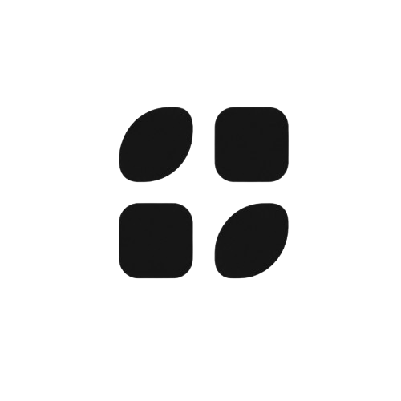

  <picture>
    <source media="(prefers-color-scheme: dark)" srcset="./assets/white-icon.png">
    
  </picture>

<h1 align="center">⬇️ Скачать MultiAI Desktop</h1>

  
  
  

  <strong>Windows 10/11, Linux (64-bit) и macOS (Apple Silicon)</strong> 
  Нажмите кнопку — скачивание последней версии начнётся сразу.

| Система | Архитектура | Формат | Статус | Скачать |
|---|:---:|:---:|:---:|:---:|
| **Windows 10/11** | **x64** | `.exe` | ✅ Поддерживается | **[⬇ Скачать EXE](https://github.com/SURVERS/MultiAI-Desktop-Official/releases/latest/download/MultiAI-Desktop-Windows-x64.exe)** |
| **Linux — универсальный** | **x64** | `.AppImage` | ✅ Поддерживается | **[⬇ Скачать AppImage](https://github.com/SURVERS/MultiAI-Desktop-Official/releases/latest/download/MultiAI-Desktop-Linux-x64.AppImage)** |
| Ubuntu / Debian / Mint | x64 | `.deb` | ✅ Поддерживается | **[⬇ Скачать DEB](https://github.com/SURVERS/MultiAI-Desktop-Official/releases/latest/download/MultiAI-Desktop-Linux-x64.deb)** |
| Fedora / RHEL / openSUSE | x64 | `.rpm` | ✅ Поддерживается | **[⬇ Скачать RPM](https://github.com/SURVERS/MultiAI-Desktop-Official/releases/latest/download/MultiAI-Desktop-Linux-x64.rpm)** |
| Windows | x86 / 32-bit | — | ❌ Не выпускается | — |
| Linux | ARM64 | — | ❌ Не выпускается | — |
| **macOS** | **ARM64 (Apple Silicon)** | `.dmg` / `.zip` | ✅ Поддерживается | **[⬇ Скачать DMG](https://github.com/SURVERS/MultiAI-Desktop-Official/releases/latest/download/MultiAI-Desktop-Setup-0.0.15-arm64.dmg)** |

Если Windows покажет SmartScreen, выберите «Подробнее» → «Выполнить в любом случае». Текущая сборка ещё не подписана коммерческим сертификатом.

Для AppImage выполните `chmod +x MultiAI-Desktop-Linux-x64.AppImage`, затем запустите файл.

[Вернуться к описанию MultiAI Desktop](./README.md)
